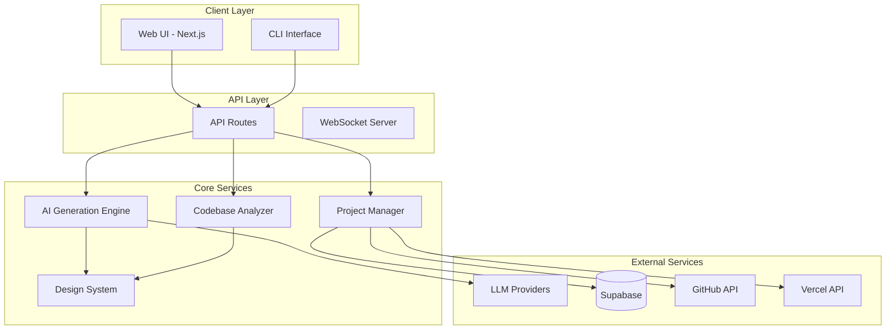
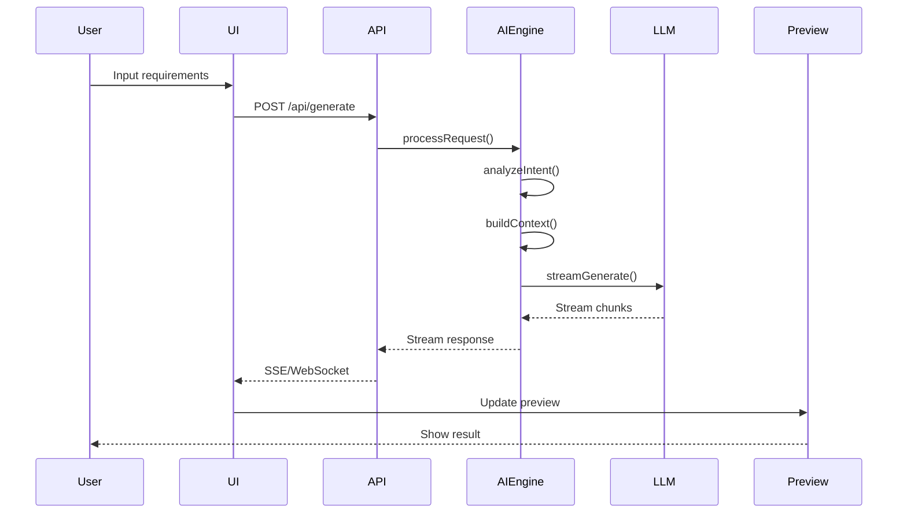
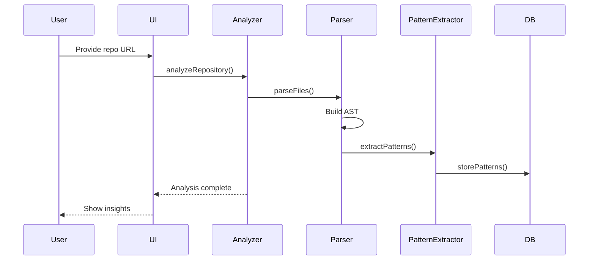
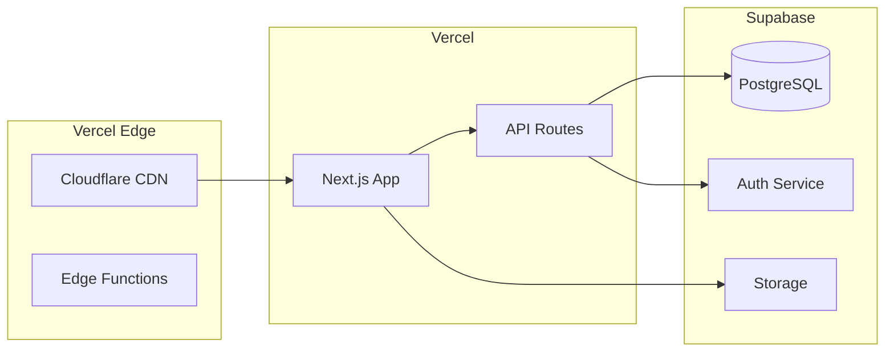

# Technical Architecture Document
## biokit-builder

Version: 1.0.0  
Date: August 2024

---

## System Overview

biokit-builder is a monorepo-based application generation platform built with Next.js 15, TypeScript, and a modular package architecture. The system employs a microservices-inspired design with clear separation of concerns between AI processing, UI rendering, data management, and deployment operations.

## Architecture Principles

1. **Modularity**: Separate packages for distinct functionality
2. **Type Safety**: TypeScript strict mode throughout
3. **Streaming First**: Real-time updates via streaming responses
4. **Security by Default**: Input validation, sandboxing, encrypted secrets
5. **Progressive Enhancement**: Start simple, scale complexity
6. **AI-Native**: Optimized for LLM interactions

## High-Level Architecture



## Component Architecture

### 1. Web Application (`apps/web`)

**Technology Stack:**
- Next.js 15 with App Router
- React 19
- TypeScript 5.x
- Tailwind CSS
- shadcn/ui components

**Key Components:**

```typescript
// App Structure
app/
├── (auth)/          # Authentication flows
├── (dashboard)/     # Main application
├── api/            # API routes
│   ├── analyze/    # Codebase analysis
│   ├── generate/   # Code generation
│   ├── deploy/     # Deployment
│   └── projects/   # Project management
└── layout.tsx      # Root layout
```

**Routing Strategy:**
- File-based routing with App Router
- Parallel routes for modals
- Intercepting routes for previews
- API routes for backend operations

### 2. AI Core Package (`@biokit/ai-core`)

**Architecture:**

```typescript
interface AIProvider {
  name: string;
  model: string;
  generateStream(prompt: string, context: Context): AsyncGenerator<string>;
  analyzeIntent(input: string): Intent;
  selectContext(files: FileManifest): SelectedFiles;
}

class AIEngine {
  private providers: Map<string, AIProvider>;
  private contextBuilder: ContextBuilder;
  private promptOptimizer: PromptOptimizer;
  
  async generate(request: GenerationRequest): Promise<GenerationResponse> {
    // 1. Analyze request intent
    // 2. Select relevant context
    // 3. Optimize prompt
    // 4. Stream generation
    // 5. Post-process output
  }
}
```

**Key Features:**
- Provider abstraction for multiple LLMs
- Context-aware generation
- Streaming responses
- Token optimization
- Error recovery

### 3. Design System Package (`@biokit/design-system`)

**Token Architecture:**

```typescript
// Design Tokens
export const tokens = {
  colors: {
    primary: generateColorScale('#0066CC'),
    semantic: {
      success: '#10B981',
      warning: '#F59E0B',
      error: '#EF4444',
      info: '#3B82F6'
    }
  },
  typography: {
    fontFamily: {
      sans: ['Inter', 'system-ui'],
      mono: ['JetBrains Mono', 'monospace']
    },
    fontSize: generateTypeScale(16, 1.25)
  },
  spacing: generateSpacingScale(4),
  breakpoints: {
    sm: '640px',
    md: '768px',
    lg: '1024px',
    xl: '1280px'
  }
}
```

**Component System:**
- Atomic design methodology
- Compound components
- Polymorphic components
- Theme variants

### 4. Database Package (`@biokit/db`)

**Schema Design:**

```sql
-- Projects table
CREATE TABLE projects (
  id UUID PRIMARY KEY,
  user_id UUID REFERENCES users(id),
  name TEXT NOT NULL,
  description TEXT,
  type TEXT NOT NULL,
  source_type TEXT, -- 'codebase' | 'requirements' | 'template'
  config JSONB,
  created_at TIMESTAMP,
  updated_at TIMESTAMP
);

-- Generations table
CREATE TABLE generations (
  id UUID PRIMARY KEY,
  project_id UUID REFERENCES projects(id),
  prompt TEXT NOT NULL,
  response TEXT,
  files JSONB,
  tokens_used INTEGER,
  provider TEXT,
  created_at TIMESTAMP
);

-- Deployments table
CREATE TABLE deployments (
  id UUID PRIMARY KEY,
  project_id UUID REFERENCES projects(id),
  url TEXT,
  status TEXT,
  provider TEXT, -- 'vercel' | 'netlify' | 'custom'
  config JSONB,
  deployed_at TIMESTAMP
);
```

**Data Access Layer:**

```typescript
class ProjectRepository {
  async create(data: ProjectInput): Promise<Project>
  async findById(id: string): Promise<Project>
  async update(id: string, data: Partial<Project>): Promise<Project>
  async delete(id: string): Promise<void>
  async listByUser(userId: string): Promise<Project[]>
}
```

## API Design

### RESTful Endpoints

```typescript
// Project Management
POST   /api/projects          // Create project
GET    /api/projects          // List projects
GET    /api/projects/:id      // Get project
PUT    /api/projects/:id      // Update project
DELETE /api/projects/:id      // Delete project

// Code Generation
POST   /api/generate          // Generate code
POST   /api/generate/stream   // Stream generation
POST   /api/analyze           // Analyze codebase
POST   /api/enhance           // Enhance existing code

// Deployment
POST   /api/deploy/vercel     // Deploy to Vercel
POST   /api/deploy/github     // Create GitHub repo
GET    /api/deploy/status/:id // Deployment status
```

### WebSocket Events

```typescript
// Real-time events
interface SocketEvents {
  'generation:start': { projectId: string }
  'generation:chunk': { chunk: string }
  'generation:complete': { files: FileManifest }
  'generation:error': { error: string }
  'preview:update': { url: string }
  'deployment:progress': { status: string, progress: number }
}
```

## Data Flow

### Code Generation Flow



### Codebase Analysis Flow



## Security Architecture

### Authentication & Authorization

```typescript
// Supabase Auth Configuration
const authConfig = {
  providers: ['github', 'google'],
  redirectUrl: process.env.NEXT_PUBLIC_APP_URL,
  sessionExpiry: 7 * 24 * 60 * 60, // 7 days
  mfa: {
    enabled: true,
    factors: ['totp']
  }
}
```

### Input Validation

```typescript
// Zod Schemas for all inputs
const GenerateRequestSchema = z.object({
  prompt: z.string().min(1).max(10000),
  projectId: z.string().uuid(),
  context: z.object({
    files: z.array(FileSchema).optional(),
    requirements: z.string().optional()
  }),
  options: z.object({
    provider: z.enum(['anthropic', 'openai', 'google']),
    model: z.string(),
    temperature: z.number().min(0).max(1)
  })
});
```

### Secret Management

```typescript
// Encrypted environment variables
class SecretManager {
  private cipher: Cipher;
  
  encrypt(value: string): string {
    return this.cipher.encrypt(value);
  }
  
  decrypt(encrypted: string): string {
    return this.cipher.decrypt(encrypted);
  }
  
  rotateKeys(): void {
    // Key rotation logic
  }
}
```

## Performance Optimization

### Caching Strategy

```typescript
// Multi-layer caching
class CacheManager {
  private memory: LRUCache;      // In-memory cache
  private redis: RedisClient;    // Distributed cache
  private cdn: CDNCache;         // Edge cache
  
  async get(key: string): Promise<any> {
    // Check memory -> Redis -> CDN
  }
  
  async set(key: string, value: any, ttl: number): Promise<void> {
    // Write to all cache layers
  }
}
```

### Code Splitting

```javascript
// Dynamic imports for heavy components
const CodeEditor = dynamic(() => import('@/components/CodeEditor'), {
  loading: () => <EditorSkeleton />,
  ssr: false
});

const Preview = dynamic(() => import('@/components/Preview'), {
  loading: () => <PreviewSkeleton />
});
```

### Database Optimization

- Connection pooling
- Query optimization with indexes
- Pagination for large datasets
- Read replicas for scaling

## Deployment Architecture

### Infrastructure

```yaml
# Docker Compose for local development
version: '3.8'
services:
  web:
    build: ./apps/web
    ports:
      - "3000:3000"
    environment:
      - NODE_ENV=development
  
  db:
    image: supabase/postgres
    ports:
      - "5432:5432"
    volumes:
      - db_data:/var/lib/postgresql/data
```

### Production Deployment



## Monitoring & Observability

### Logging

```typescript
// Structured logging
import { Logger } from '@biokit/logger';

const logger = new Logger({
  service: 'ai-engine',
  level: process.env.LOG_LEVEL || 'info'
});

logger.info('Generation started', {
  projectId,
  userId,
  prompt: prompt.substring(0, 100),
  provider
});
```

### Metrics

```typescript
// Key metrics to track
const metrics = {
  'generation.duration': histogram(),
  'generation.tokens': counter(),
  'api.requests': counter(),
  'api.errors': counter(),
  'deployment.success': counter(),
  'deployment.failure': counter()
};
```

### Error Tracking

```typescript
// Sentry integration
Sentry.init({
  dsn: process.env.SENTRY_DSN,
  environment: process.env.NODE_ENV,
  tracesSampleRate: 0.1,
  integrations: [
    new Sentry.BrowserTracing(),
    new Sentry.Replay()
  ]
});
```

## Scalability Considerations

### Horizontal Scaling

- Stateless API design
- Session storage in Redis
- Load balancing with health checks
- Auto-scaling based on metrics

### Vertical Scaling

- Worker threads for CPU-intensive tasks
- Streaming for memory efficiency
- Lazy loading of components
- Database connection pooling

## Testing Strategy

### Test Pyramid

```
         /\
        /  \    E2E Tests (10%)
       /____\   
      /      \  Integration Tests (30%)
     /________\ 
    /          \ Unit Tests (60%)
   /____________\
```

### Test Implementation

```typescript
// Unit test example
describe('AIEngine', () => {
  it('should select appropriate context', async () => {
    const engine = new AIEngine();
    const context = await engine.selectContext(mockFiles);
    expect(context).toHaveLength(5);
    expect(context[0].relevance).toBeGreaterThan(0.8);
  });
});

// Integration test example
describe('Code Generation API', () => {
  it('should generate valid TypeScript', async () => {
    const response = await request(app)
      .post('/api/generate')
      .send({ prompt: 'Create a login form' });
    
    expect(response.status).toBe(200);
    expect(response.body.files).toContain('LoginForm.tsx');
  });
});
```

## Future Considerations

### Extensibility Points

1. **Plugin System**: Allow third-party extensions
2. **Custom Providers**: Support for private LLMs
3. **Template Marketplace**: Community templates
4. **Webhook System**: Integration with external services

### Technology Upgrades

- **Python Backend**: FastAPI for ML operations
- **GraphQL API**: For complex queries
- **Kubernetes**: For enterprise deployments
- **Multi-region**: Global deployment support

## Conclusion

The biokit-builder architecture is designed for scalability, maintainability, and extensibility. By leveraging modern web technologies and best practices, the system can handle rapid growth while maintaining code quality and performance. The modular design allows for independent scaling and development of components, ensuring the platform can evolve with user needs.